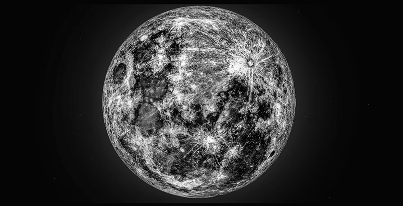
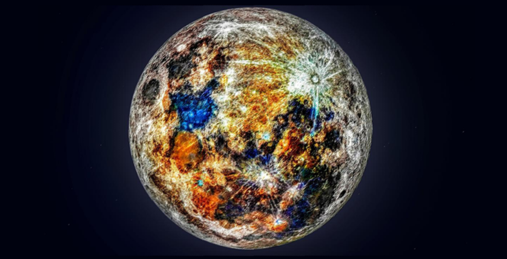

# Image-Manager
 
### Aplicativo que usa la libreria opencv y openmpi para el tratamiento de imagenes (Proximamente se implementará posix).

Para esta aplicación se usó el lenguaje `c++`, junto con las librerías de `openmpi` y `opencv`.

Requiere tener instalado y configurado `openmpi`

Requiere tener instalado la libreria `libopencv-dev` usando `sudo apt-get install libopencv-dev`en Ubuntu 20.04.

Posteriormente se usará `Posix` para el uso de `Thread` para optimizar el tratamiento de imagenes, por lo que el uso de SO basados en `Linux`será obligatorio.

Es necesario configurar el archivo `.../img-mang/maquinas.txt` con las máquinas que se disponen para el uso del programa y cambiar la ruta de salida de las imagenes guardadas dentro de la funcion `saveImage()` a la ruta donde quiere que se guarde la imagen.

Además, se debe ejecutar `.../img-mang$ make clean && make` para la compilación del aplicativo.

El aplicativo cuenta con 3 opciones para el tratamiento de imagenes:

* 1.- Difuminado de imagenes, utilizando difuminado gaussian. Para su uso, utilizar la siguiente línea `.../img-mang$ mpirun --hostfile maquinas.txt ./dist/programa 1 <path de la imagen>`

* 2.- Escala de grises. Para su uso, utilizar la siguiente línea `.../img-mang$ mpirun --hostfile maquinas.txt ./dist/programa 2 <path de la imagen>`

* 3.- Escalado de imagen 2x. Para su uso, utilizar la siguiente línea `.../img-mang$ mpirun --hostfile maquinas.txt ./dist/programa 3 <path de la imagen>`

Ejemplos:

  
  
  
  

